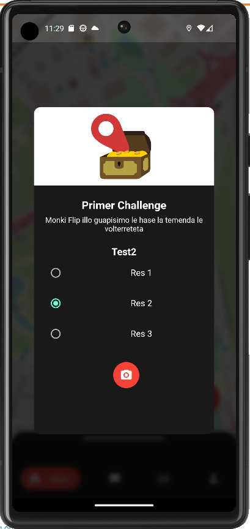

# ea_frontend
## //-------------------MINIM 2-----------------------\\

### //------Backend-------//
Creat model a BBDD, array de strings com a preguntes i respostes. La meva idea es que a front agafem el valor [0] com a pregunta i la resta com a posibles respostes. Te tambe una nova entrada que es "answer", on si == resposta desde front llavors tot perfe👍. Revisat que puc fer un post a la API i introdueix el challenge nou a la BBDD
Revisat tambe que puc fer un get amb id i retorna el challenge correctament
S'ha començat a fer la llogica de fer solve, resta retornar una resposta  

### //------Frontend-------//
A la primera aproximació, he adaptat el model de challenge i no peta, algo es algo
Seguent pas -> Quan cliquem a un challenge, mostrar les preguntes + respostes (encara que sigui amb un log per consola)
Estat:  

  - Modificada la "card" per poder tractar questions i answer
  - Vale tenim llistat de les preguntes pero tenim overflow
  - Fixat overflow fent la capsa una mica mes gran i afegint un ScrollView
  - Afegit Radio buttons a la llista
  - Fet que el primer item sigui negreta i mes gran  

M'agradaria fer que quan es llegeix el QR, fem una trucada a la API amb l'id del Challenge (que pot ser el propi QR) i la resposta que ha seleccionat l'usuari. Per exemple si seleccionem la resposta 2, la peticio seria:
	http://API:3002/challenge/post/64594b899176a09080f61967/resposta2
